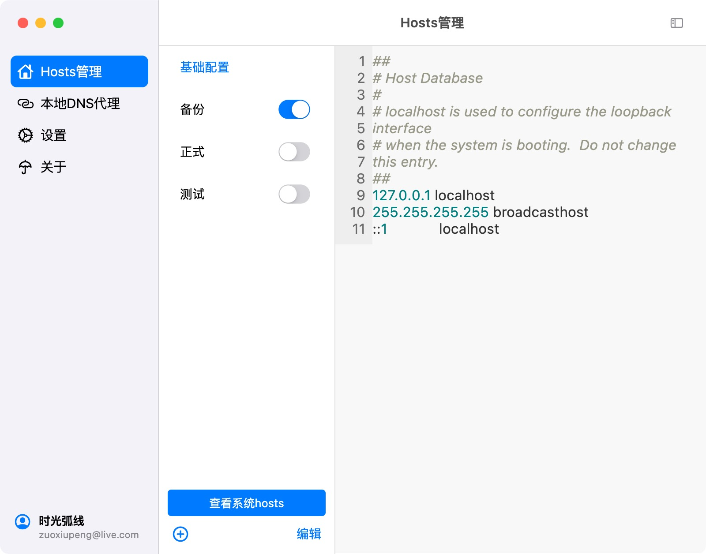
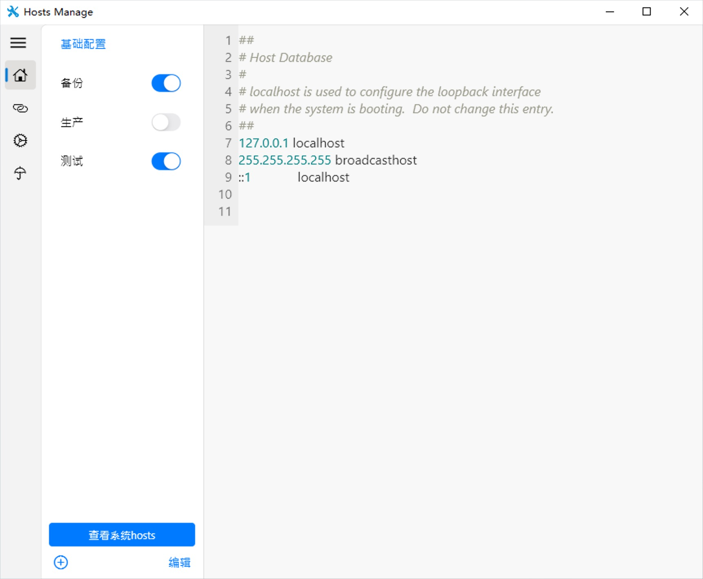
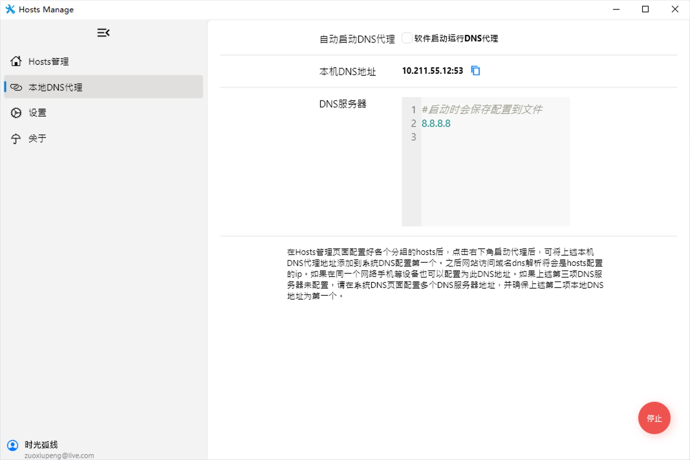
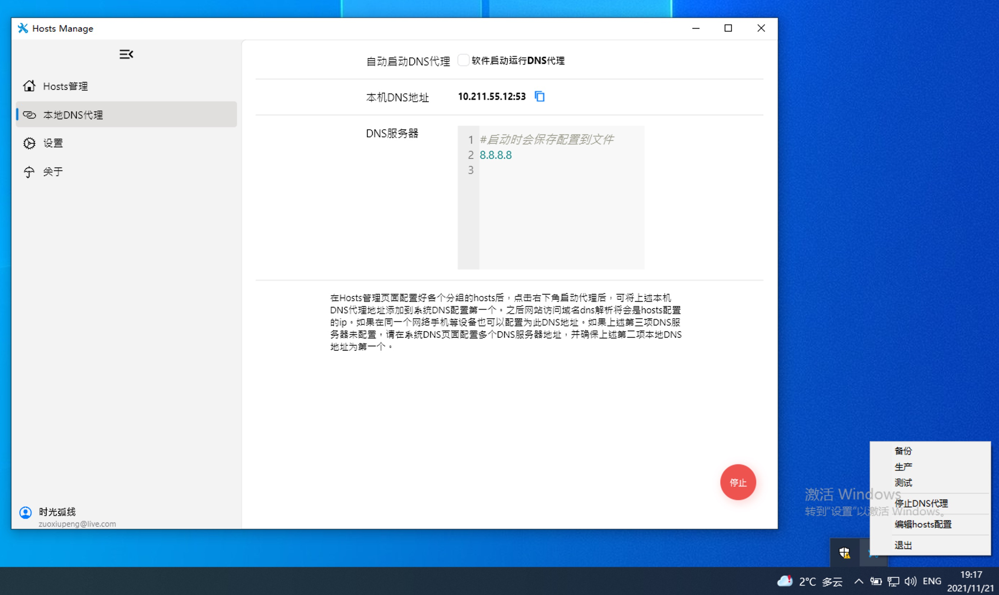

# Hosts Manage

hosts文件管理工具，同时支持基于hosts文件启动DNS代理，共享给其它设备或其他人使用。

## 功能
1. [x] 支持多组hosts配置，多组之间开启后且关系组合。
2. [x] 支持DNS代理，A记录请求会匹配到hosts文件中设置的ip域名映射。
3. [ ] 支持获取github等开发常用域名的ip本地缓存，可能会加快访问速度。 

## MacOS截图

截图为macOS 11.0 Big Sur以上版本效果




## WIndows截图




## 备注

需要替换的域名
```
github.com
codeload.github.com
assets-cdn.github.com
github.global.ssl.fastly.net
stackoverflow.com
stackexchange.com
superuser.com
```

windows 打包工具
```
PS c:\src\flutter_project\> flutter build windows
PS c:\src\flutter_project\> flutter pub run msix:create
```
